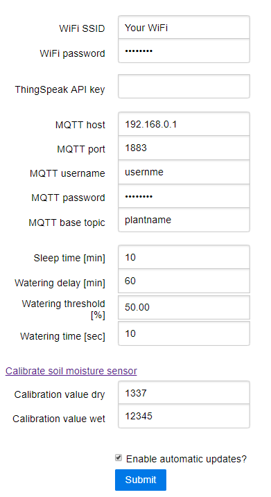
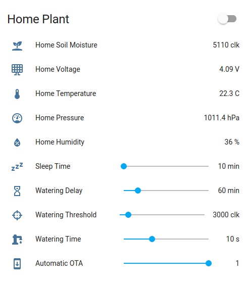

<div align="center">
  
</div>

The code is licensed under the GNU General Public License Version 3.

The PCB is licensed under the Creative Commons Attribution-ShareAlike 4.0 license due to using an [ESP8266 kicad library](https://github.com/jdunmire/kicad-ESP8266) and a particular [soil moisture probe design](https://github.com/acolomitchi/cap-soil-moisture-v2).
_________

[](https://github.com/MadsBornebusch/PlantFriends/actions?query=branch%3Amaster)

This is a plant watering ESP8266.

 

# Features

* Fully open source (software and hardware)
* Automatic OTA update via Github release - enable/disable using checkbox
* OTA updates via a web interface
* Works with any MQTT server
* Works with Home Assistant discovery
* Set the sleep time, watering delay, water threshold, water time etc via MQTT
* Works with ThingSpeak
* Temperature, pressure and humidity using BME280

# PCB

 

## Pinout when seen from component side:

Left side from top:

- FTDI_RX
- FTDI_TX
- SDA
- SCL
- GND
- Battery VCC

## Right side from top:

- Battery VCC IN
- GND
- VCC (3.3 V)
- Watering OUT

# Settings

The WiFi, ThingSpeak and MQTT settings can be configured via a web interface:



If you do not want to use ThingSpeak simply leave the `ThingSpeak API key` field empty. Similarly the MQTT can be disabled by leaving the `MQTT base topic` empty.

At first boot the module will turn on a hotspot with the SSID: `PlantFriends` and password: `plantsarecool`.

After logging on to the WiFI simply navigate to <http://plantfriends.local> or <http://192.168.4.1> to configure the module.

The device can be put back into hotspot mode by shorting the TX and RX pins and restarting the module.

A new firmware and file system image can be uploaded by navigation to <http://plantfriends.local/update> or <http://192.168.4.1/update>.

## Calibrating the soil moisture sensor
Click "Calibrate Soil moisture sensor". 
Follow the instructions. Some handy tips:
- Don't get the electronics wet, only the sensor part
- When doing the wet calibration, use a half full glass of water (or half empty if you are that tye of person). Half of the sensor should be in water. Otherwise the readings when the sensor is put in soil will be very low. 
- If you need to redo a step in the calibration, just refresh the page.

Images of the wet and dry calibration are shown below:

 

# [Home Assistant](https://www.home-assistant.io/)

Simply activate [MQTT discovery](https://www.home-assistant.io/docs/mqtt/discovery/) by adding the following to your `configuration.yaml` file:

```yaml
mqtt:
  discovery: true
```

Assuming your plant is named `office` it will now show up as a sensor like so:


TODO: Upate this image!

The name of the plant is taken from the `MQTT base topic` and get be chaned via the [HTTP settings](#Settings) page.

## Advanced Home Assistant configuration

This section will guide you through on how to set the `sleep time`, `watering delay`, `watering threshold` and `watering time` directly via the Home Assitant overview page.

First add the following to your `configuration.yaml` file:

```yaml
input_number:
  office_sleep_time:
    name: Sleep Time
    min: 10
    max: 60
    step: 5
    icon: mdi:sleep
    unit_of_measurement: min
  office_watering_delay:
    name: Watering Delay
    min: 0
    max: 360
    step: 10
    icon: mdi:timer-sand
    unit_of_measurement: min
  office_watering_threshold_pct:
    name: Watering Threshold Pct
    min: 0
    max: 100
    step: 0.1
    icon: mdi:target
    unit_of_measurement: pct
  office_watering_time:
    name: Watering Time
    min: 1
    max: 30
    step: 1
    icon: mdi:water-pump
    unit_of_measurement: s
  office_automatic_ota:
    name: Automatic OTA
    min: 0
    max: 1
    step: 1
    icon: mdi:cellphone-arrow-down
```

This will create four [sliders](https://www.home-assistant.io/integrations/input_number/), one for each parameter. Remember to replace `office` with the `MQTT base topic` you have set via the web interface.

Now add the following to your `automations.yaml` file:

```yaml
- alias: Plant set slider
  trigger:
  - platform: mqtt
    topic: 'plant/+/config'
  action:
  - service: input_number.set_value
    data_template:
      entity_id: input_number.{{ trigger.topic.split('/')[1] }}_sleep_time
      value: "{{ trigger.payload_json.sleep_time | float }}"
  - service: input_number.set_value
    data_template:
      entity_id: input_number.{{ trigger.topic.split('/')[1] }}_watering_delay
      value: "{{ trigger.payload_json.watering_delay | float }}"
  - service: input_number.set_value
    data_template:
      entity_id: input_number.{{ trigger.topic.split('/')[1] }}_watering_threshold_pct
      value: "{{ trigger.payload_json.watering_threshold_pct | float }}"
  - service: input_number.set_value
    data_template:
      entity_id: input_number.{{ trigger.topic.split('/')[1] }}_watering_time
      value: "{{ trigger.payload_json.watering_time | float }}"
  - service: input_number.set_value
    data_template:
      entity_id: input_number.{{ trigger.topic.split('/')[1] }}_automatic_ota
      value: "{{ trigger.payload_json.automatic_ota | float }}"

- alias: Plant slider moved
  trigger:
  - platform: state
    entity_id:
      - input_number.office_sleep_time
      - input_number.office_watering_delay
      - input_number.office_watering_threshold_pct
      - input_number.office_watering_time
      - input_number.office_automatic_ota
  action:
  - service: mqtt.publish
    data_template:
      # The topic should always be the after the dot and before the name of the variable we want to set
      topic: "plant/{{ trigger.entity_id.split('.')[1].split('_')[:-2] | join('_') }}/config"
      retain: true
      payload: >
        
        {
          "sleep_time": {{ states('input_number.' + topic + '_sleep_time') | int }},
          "watering_delay": {{ states('input_number.' + topic + '_watering_delay') | int }},
          "watering_threshold": {{ states('input_number.' + topic + '_watering_threshold_pct') | int }},
          "watering_time": {{ states('input_number.' + topic + '_watering_time') | int }},
          "automatic_ota": {{ ((states('input_number.' + topic + '_automatic_ota') | int) > 0) | tojson }}
        }
```

This makes sure that the MQTT config topic is updated when the slider is moved and that the slider is always set to the MQTT config topic when it changes.

Finally you can add the sensors and the inputs slider into on group by adding the following to `groups.yaml`:

```yaml
office_plant:
    name: "Office Plant"
    icon: mdi:sprout
    entities:
    - sensor.office_soil_moisture_pct
    - sensor.office_voltage
    - sensor.office_battery
    - sensor.office_temperature
    - sensor.office_pressure
    - sensor.office_humidity
    - input_number.office_sleep_time
    - input_number.office_watering_delay
    - input_number.office_watering_threshold_pct
    - input_number.office_watering_time
    - input_number.office_automatic_ota
```

Note that the `temperature`, `pressure` and `humidity` sensors are only available if a BME280 is connected.

The plant will now show up in the Home Assistant overview like so:



TODO: Update this image

# ThingSpeak

TODO: Add guide
